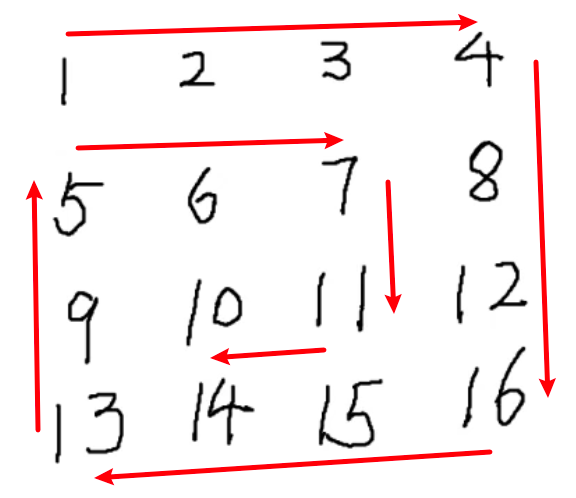

**中等**

给你一个 `m` 行 `n` 列的矩阵 `matrix` ，请按照 **顺时针螺旋顺序** ，返回矩阵中的所有元素。

**示例 1：**


```
输入：matrix = [[1,2,3],[4,5,6],[7,8,9]]
输出：[1,2,3,6,9,8,7,4,5]
```

**示例 2：**


```
输入：matrix = [[1,2,3,4],[5,6,7,8],[9,10,11,12]]
输出：[1,2,3,4,8,12,11,10,9,5,6,7] 
```

**提示：**

- `m == matrix.length`
- `n == matrix[i].length`
- `1 <= m, n <= 10`
- `-100 <= matrix[i][j] <= 100`

**解析**



1. 用 current 模拟一个人，按照右，下，左，上的方向走遍 matrix 的每一个点
2. 右，下，左，上的方向可以用 directions 数组表示，direction.next 表示下一个方向
3. 先把 matrix 右上角、右下角、左下角、左上角的外边界对应的点 cache 一下
4. 每次走过的点都 cache 一下，并根据 cache 和 direction 求出**有效的** nextNode，并把 nextNode push到 res 数组
5. while 遍历完成

```js
/**
 * @param {number[]} nums
 * @return {number}
 */
// 以第一个坐标为 x ，x 向下
var matrix =
  // Ylen ↓
  [
    //  Xlen  Xlen →
    [1, 2, 3],
    [4, 5, 6],
    [7, 8, 9],
  ];

let directions = [
  { x: 1, y: 0 },
  { x: 0, y: 1 },
  { x: -1, y: 0 },
  { x: 0, y: -1 },
];

directions.forEach((obj, index) => {
  obj.next = directions[index + 1];
});
directions[3].next = directions[0];

var spiralOrder = function (matrix) {
  const Xlen = matrix[0].length;
  const Ylen = matrix.length;
  const cache = {
    [`${Xlen},0`]: true,
    [`${Xlen - 1},${Ylen}`]: true,
    [`-1,${Ylen - 1}`]: true,
    [`0,-1`]: true,
  };
  const res = [];
  const totleNums = Xlen * Ylen;
  let current = { x: -1, y: 0 };
  let direction = directions[0];
  const getNextNode = () => {
    const node = {
      x: current.x + direction.x,
      y: current.y + direction.y,
    };
    return node;
  };
  const getKey = (node) => `${node.x},${node.y}`;
  const nextNodeIsValid = () => {
    const nextNode = getNextNode();

    const currentKey = getKey(current);
    const nextNodeKey = getKey(nextNode);
    if (cache[nextNodeKey]) {
      return false;
    } else {
      return nextNode;
    }
  };
  nextNodeIsValid();
  let i = 0;
  while ((res.length < totleNums) & (i++ <= totleNums)) {
    const currentKey = getKey(current);
    cache[currentKey] = true;
    const nextNode = nextNodeIsValid();
    if (nextNode) {
      current = nextNode;
    } else {
      direction = direction.next;
      const nextNode = nextNodeIsValid();
      current = nextNode;
    }
    const num = matrix[current.y][current.x];
    res.push(num);
  }
  return res;
};
```

