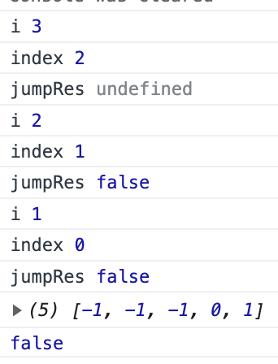
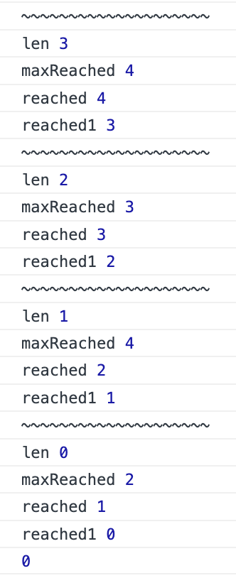

**中等**

相关企业

给定一个非负整数数组 `nums` ，你最初位于数组的 **第一个下标** 。

数组中的每个元素代表你在该位置可以跳跃的最大长度。

判断你是否能够到达最后一个下标。 

**示例 1：**

```
输入：nums = [2,3,1,1,4]
输出：true
解释：可以先跳 1 步，从下标 0 到达下标 1, 然后再从下标 1 跳 3 步到达最后一个下标。
```

**示例 2：**

```
输入：nums = [3,2,1,0,4]
输出：false
解释：无论怎样，总会到达下标为 3 的位置。但该下标的最大跳跃长度是 0 ， 所以永远不可能到达最后一个下标。 
```

**提示：**

- `1 <= nums.length <= 3 * 104`
- `0 <= nums[i] <= 105`

解析

思路1：动态规划

动态规划都分为两种解法：

- top down
- bottom up

思路2：贪心算法

以 nums = [3,1,0,2,4] 为例

1. **top down**
   1. 3 -> 1 -> 0 不通
   2. 3 -> 0        不通
   3. 3 -> 2 -> 4 通

```js
/**
 * @param {number[]} nums
 * @return {boolean}
 */
var canJump = function(nums) {
  const len = nums.length
  const dp = Array(len).fill(0)
  dp[len -1 ] = 1
  const res = jump(0)
  function jump(index) {
    if(dp[index] === 1) return true
    if(dp[index] === -1) return false
    const maxJump = Math.min(index + nums[index], len -1)
    for(let i = index + 1; i <= maxJump; i++) {
      const jumpRes = jump(i)
      console.log(`i`, i)
      console.log(`index`, index)
      console.log(`jumpRes`, jumpRes)
      if(jumpRes) {
        dp[index] = 1
        return true
      } else {
        dp[index] = -1
        return false
      }
    }
  }
  console.log(dp)
  console.log(res)
  return res
};
```



2. **贪心算法**
   1. nums = [3,1,0,2,4]
   2. reached = 5 - 1 = 4
   3. 下标 3 + 2 >= reached，reached = 3
   4. 下标 2 + 0 < reached，reached = 3
   5. 下标 1 + 1 < reached，reached = 3
   6. 下标 0 + 3 >= reached，reached = 0
   7. reached = 0 则能够达到，reached > 0 则不能达到，所以这次能够达到

```js
/**
 * @param {number[]} nums
 * @return {boolean}
 */
var canJump = function(nums) {
  let len = nums.length
  let reached = len - 1
  --len
  while(--len >= 0) {
    f1()
    const maxReached = len + nums[len]
    console.log(`len`, len)
    console.log(`maxReached`, maxReached)
    console.log(`reached`, reached)
    reached = maxReached >= reached ? len : reached
    console.log(`reached1`, reached)
  }
  console.log(reached)
  if (reached === 0) return true
  return false
};
```



```js
/** 上面优化之后
 * @param {number[]} nums
 * @return {boolean}
 */
var canJump = function(nums) {
  let len = nums.length
  let reached = len - 1
  --len
  while(--len >= 0) reached = len + nums[len] >= reached ? len : reached
  if (reached === 0) return true
  return false
};
```

