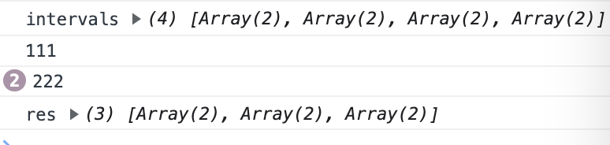

**中等**

以数组 `intervals` 表示若干个区间的集合，其中单个区间为 `intervals[i] = [starti, endi]` 。请你合并所有重叠的区间，并返回 *一个不重叠的区间数组，该数组需恰好覆盖输入中的所有区间* 。

**示例 1：**

```
输入：intervals = [[1,3],[2,6],[8,10],[15,18]]
输出：[[1,6],[8,10],[15,18]]
解释：区间 [1,3] 和 [2,6] 重叠, 将它们合并为 [1,6].
```

**示例 2：**

```
输入：intervals = [[1,4],[4,5]]
输出：[[1,5]]
解释：区间 [1,4] 和 [4,5] 可被视为重叠区间。 
```

**提示：**

- `1 <= intervals.length <= 104`
- `intervals[i].length == 2`
- `0 <= starti <= endi <= 104`

思路：

1. 将 intervals 中的区间按照起始位置排序
2. 用 curr 数组记录当前合并的最大区间，遍历 intervals 中的每一个区间，如果 当前区间的起始位置<= curr 的终点位置，则合入 curr 并更新 curr 的终点位置。
3. 如果 当前区间的起始位置 > curr 的终点位置，则无法合并。所以将 cur r加入到 result 里，并用当前的区间替换 curr 的值。

```js
var intervals = [[1,3],[2,6],[8,10],[15,18]]
/**
 * @param {number[][]} intervals
 * @return {number[][]}
 */
var merge = function(intervals) {
  let len = intervals.length
  if (len < 2) return intervals
  intervals = intervals.sort((arr1, arr2) => (arr1[0] >= arr2[0]))
  console.log(`intervals`, intervals)
  let cur = intervals[0]
  const res = []
  for(let i = 1; i < len; i++) {
    if (cur[1] >= intervals[i][0]) {
      cur[1] = Math.max(intervals[i][1], cur[1])
      console.log(`111`)
    } else {
      res.push(cur)
      cur = intervals[i]
      console.log(`222`)
    }
  }
  res.push(cur)
  console.log(`res`, res)
  return res
};

merge(intervals)
```



**注意**，最后需要 `res.push(cur)`，因为必然会走到 `console.log(’222‘)`，也就是有最后一个 interval 没有被 push 进去
